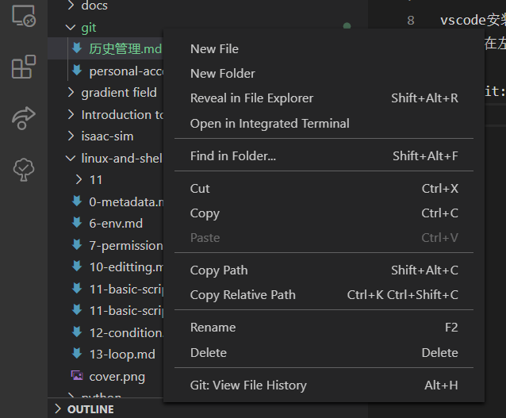
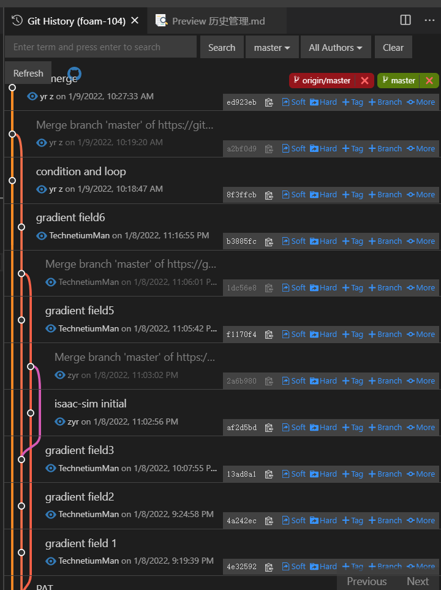

- 前置[[vscode-git]]
# git history
- 查看一个文件或文件夹的历史记录
  - 左边文件栏中右键点击某个文件/文件夹
    - 
  - 点击git: view file history
    - 
  - 文件编辑者和branch一目了然！
- 查看整个库
  - 法一：`Ctrl+Shift+P`搜索`history`
  - 法二：`Ctrl+Shift+G`出来的那个界面（左侧git图标那个界面）每个库标题右边有个“时钟”图标
    - 法二方便选择你要看[[submodule]]中的哪个
# git graph
- 跟[git history](#git-history) 总体类似
- 2023.3时，比它好用bug少（比如[git history](#git-history)有时不reload不更新）