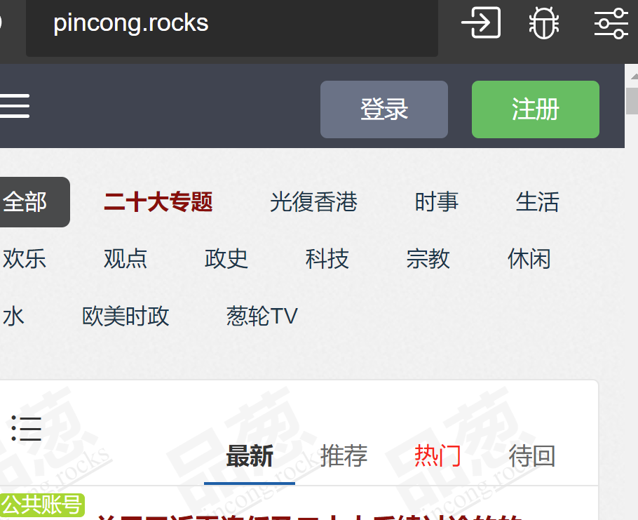

和浏览html相关的插件
- `EmbeddedBrowser`可打开（单个）外部网页
  - 有前进、后退、刷新、历史等
  - `Ctrl+Shit+P -> Open Browser`打开浏览器，输入`https://baidu.com`即可看到百度
  - 可以自动使用代理
  - 协议头如`https://`不能省
    - 由于协议头不能省+只能打开单个网页，故现阶段该插件典型使用方法是在普通浏览器中打开网址，然后地址栏复制地址，过来打开单个网页用于作参考（如参考文档、博客等）
  - `https://ipinfo.io/`可看到使用的ip
    - 注意：此时可临时调整vscode颜色设置为浅色，否则黑色字看不清
- `VS Browser`可打开（单个）外部网页
  - 可以自动使用代理
    - 
  - 无需输入协议头
  - 时至2022.10部分网页（如google.com）显示可能有问题但`EmbeddedBrowser`没问题。总之两者各有优劣
- `open in browser`可`Alt+B`用默认浏览器打开本地`.html`