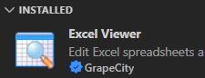

# 安装
  - gui：`Ctrl + Shift + X`搜索插件并点击Install安装
  - 命令行：参考[[vscode/command-line]]
  - 离线（涉及内网时）
    - https://blog.csdn.net/Sky_fy_1314/article/details/123865926?spm=1001.2101.3001.4242.2&utm_relevant_index=4
      - https://marketplace.visualstudio.com/vscode
      - 搜索
      - 右侧栏下载`.vsix`
- 点击左侧INSTALLED栏目中插件条目
  - 
- 打开其主页
  - 看其中教程学习使用方法
- 做出适当配置
  - [[settings-json]]
  - [[settings-and-configurations]]
# 使用
- 可能是vscode界面（左侧）出现按钮
  - [[robocorp/basics/installation]]
  - [[remote-ssh]]
- 可能是`Ctrl + Shift + P`的command palette中出现新命令
  - [[git-project-manager]]
  - [[view-git-log#git history]]
  - 这时可以结合[[vscode-keyboard-shortcuts]]设置快捷键
- 可能是右键菜单出现选项
  - [[view-git-log#git history]]
- 管理插件：`Ctrl+Shift+X`出来的界面，可以卸载或禁用等
- 注：有时若干个插件是打成包的，比如`python`，其中包含了[[jupyter-notebook]]
  - 卸载也是一起卸载
# 插件和其它软件关系
- 有时，本身完成实际功能的软件并不是vscode，也不集成在vscode插件中。vscode插件只是调用接口
  - 这里参考系统的“内核”和“外壳”[[shell]]思想（其实vscode本身有时就相当于某种“外壳”）
  - [[paste-images-from-clipboard]] needs `sudo apt install xclip` in Ubuntu.
  - 直接下载安装`python`
    - 或[[conda-installation]]安装后
    - vscode的[[python]]相关插件才有用
    - **插件本身当然不能集成python解释器**！（你想想插件一共才多大呢）
  - [[git-installation]]安装后
    - `Ctrl+Shift+G`功能
    - [[view-git-log#git history]]插件才能用
  - latex，cpp等也都是这样
  - 特殊情况
    - 对于linux系统，shell的“解释器”（“内核”）当然内置在系统中了
    - 所以[[bash-debug]]拿到就能用
- 有时，[[markdown-preview-enhanced]]这种特别轻量级的东西可以“集成到vscode插件中”，即插即用
- 特殊：vscode本身和[[node-js]]联系密切，内置js解释器
# troubleshooting
- [[remote-ssh]]时，远程插件版本高，本地vscode版本低，可能导致插件用不了，需要更新本地vscode