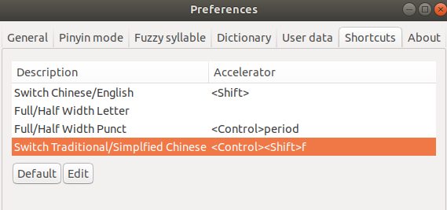

## 总述
- File - Preferences - Keyboard Shortcuts看列表（快捷键`Ctrl+K Ctrl+S`）
  - 此处
    - 可以搜索，可以增删改查快捷键
    - 这里可以看到自定义了的快捷键但看不到已经删除默认的
  - 但这个右侧按钮看`json`可以看所有自己修改过的（包括增删改）
  - 比如一个例子
```json
// Place your key bindings in this file to override the defaultsauto[]
[
    {
        "key": "ctrl+shift+alt+h",
        "command": "git.viewHistory"
    },
    {
        "key": "ctrl+shift+alt+t",
        "command": "python.launchTensorBoard"
    },
    {
        "key": "ctrl+b",
        "command": "-workbench.action.toggleSidebarVisibility"
    }
]
```
这里`Ctrl+B`删掉是为了防止和[[tmux]]冲突
- `Ctrl+K`后接别的键的快捷键称为chord快捷键
  - 如果接的是单字母，那么在中文输入法或者只读编辑窗口会用不了。比如`Ctrl+K U`关闭所有已保存的标签
  - 所以不妨把这类快捷键自定义修改了
- `Ctrl+Alt+Shift`一起按的往往都给你留着了
## 调试相关
- `Ctrl + Shift + D`到调试面板
  - 此时默认在左上角绿色播放按钮处。可以按右键，再按上下键，调整使用的`launch`设置，然后直接`F5`（纯键盘操作，爽！）
- `F5`运行或断点状态下继续（请结合[[launch]]使用，最大化效率。达到“一键启动”效果）
  - 还可以结合断点，直接`F5`到指定位置
- `F10`单步
- `F11`进入
- `Shift+F11`跳出当前（函数等等）
## 搜索
- `Ctrl + P`搜索文件名
- `Ctrl + Shift + F`全文查找
  - 不过这个有时会被占用。比如
  - 右键，把所有复选框去掉勾并删除字母`f`就能去掉这一快捷键
- 当然文档里普通的`Ctrl+F`查找还是有的
## troubleshooting
一些特殊地方可能会用不了快捷键
- 比如[[tensorboard]]在vscode中的窗口
- 比如vscode-pdf预览窗口