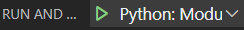

## `launch.json`
`launch.json`可以指定运行时的各种配置。比如
- 运行什么文件
- 在什么目录下运行（防止`python`找不到包）
- 参数（各种`--...`之类的。这样就不用每次重新复制长串命令）
## `python -m`例子
比如想要用`launch.json`中的一套配置去表示一个`python -m 某某`命令以方便复用，就可以
- `Ctrl + Shift + D` - 左侧create a launch.json file - 上方Module - 输入名字
- 进去`launch.json`之后，可以看到`"name"`字段，可以自定义名称，就能显示在左上角绿色播放键旁边
## 解释器
比如`conda activate <名字>`，`which python`找到python解释器，然后左下角选解释器