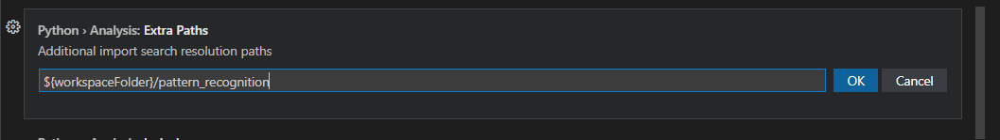

## `settings.json`和设置概述
- `Ctrl + Shift + P`，`Preferences: Open Settings (JSON)`，里面可以做各种设置。参考[[JSON常见语法]]
- 当然，也有图形界面
  - 例如插件右键 - Extension Settings
  - 这是`pylance`插件的gui设置的一个局部
  - json设置项很多在图形界面也容易找到
  - 图形界面的一些设置项在json可以找到
    - 找不到的，即为使用默认
    - 此时你可以去图形界面进行设置，使得不再是默认，那么json中也就会出现相应条目
  - 修改json和gui中设置所需要的内容可能有些不同
    - 例如`\`转义是写一个还是两个，参考[[excel-viewer]]
- 设置是“层次化”的，参考[[settings-and-configurations]]
  - 用户等级的`settings.json`往往存在本地电脑中和用户相关的文件夹中，比如windows10中在`Roaming`文件夹中的某个地方
  - 打开的文件夹的`.vscode/settings.json`文件会覆盖用户等级的`settings.json`
## 一个具体应用
- 例如`pylance`解析时，如果你这个库有需要额外添加的[[sys-path]]，想让`pylance`能识别到，就不妨在这个库的`.vscode/settings.json`添加这种
```json
{
    "python.analysis.extraPaths": [
    "${workspaceFolder}/pattern_recognition"
    ],
}
```
- 具体怎么找到应该添加什么内容？刚刚提到过
  - 可以先用gui设置
  - 然后再去用户等级`settings.json`找到相应内容，剪切
  - 粘贴到打开的文件夹的`.vscode/settings.json`文处
## 一些常用设置项
- `"editor.wordWrap": "on"`打开自动换行
  - 可能需要删除`"editor.accessibilitySupport": "on"`才能用
- `"editor.fontFamily"`：设置字体
- `"terminal.integrated.defaultProfile.linux"`调整linux环境中默认用什么终端
- `"git.terminalAuthentication": false`去除自动Authentication
  - 当然，这样就导致每次都要输入账号和[[personal-access-tokens]]
  - 如果自动的Authentication不符合要求（比如不是你要的账号等等），当然就要如此去除
  - 确认正确了（能正常用了）再设回`true`
- `"http.proxy": "http://<ip>:<port>"`：设置代理
  - 默认情况：可能是继承了[[6-env]]的环境变量
  - 这又是“用户级覆盖系统级”的例子
- 当然，这些设置项的名称和细节可能随着版本和系统不同而变化