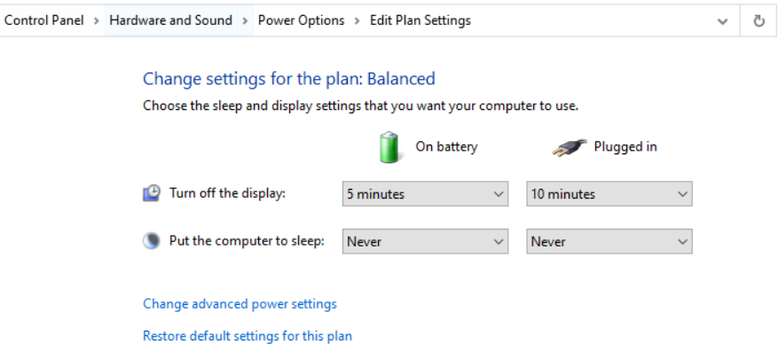
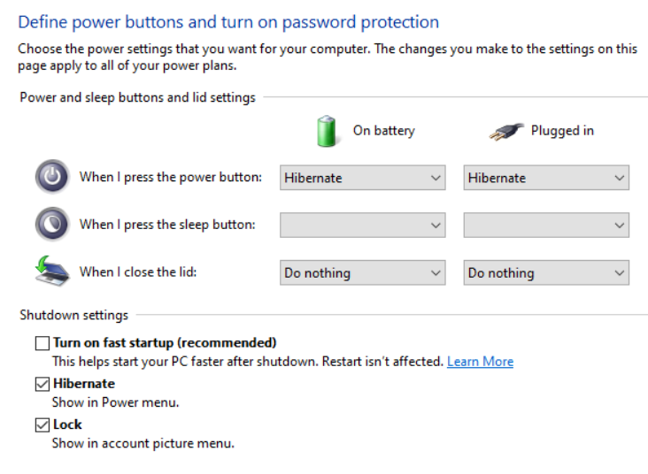

前置
- [[sleep-hibernate]]

内容
- 开始菜单搜索`power & sleep`，看到对应设置
  - 其中`additional...`按钮通往控制面板
  - 控制面板的细节比Settings多，参考[[settings-and-configurations]]
  - 控制面板中可以
    - 新建或调整plan
      - 这里可以自己创造一个超级省电plan
    - 控制多久不动会怎么样
    - 控制按按钮或合盖子会怎么样，以及控制开始菜单电源键包含哪些选项
      - 这里可能需要管理员权限才能打开所有设置功能
      - 
      - 常用的：close the lid改成Do nothing，使得不需要像清华卷王一样骑车时一直打开电脑让他持续不休眠跑
    - fast startup会对双系统造成影响，参见[[risk]]，如果用双系统请别开
- 开始菜单搜索`Battery`，又是一波可以设置节电的
  - 和之前的plan的省电可以叠加
  - 还可以开节电模式时自动调亮度
  - 还可以看什么应用耗电多。不妨关掉
- 注：其它省电方式
  - 降低亮度到最低也能省电
  - [[win-disable]]独显
  - 关掉不要的应用，清理托盘，参考[[quit]]
- 省电结果可以用[[aida64]]看目前功率