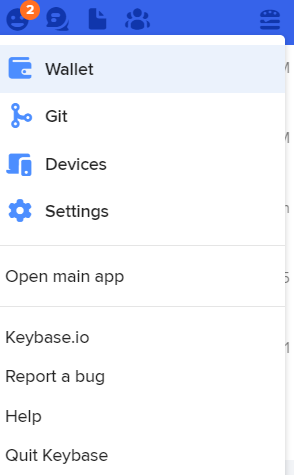

退出app节省内存和电量
- 一般软件：叉掉，`Alt+F4`
- 稍微恼火的软件：右下角托盘右键关掉
- 更加恼火的软件：专门的关闭方法
  - 如[[keybase]]
    - 
    - 托盘图标-右上角图标-quit Keybase
- 关不干净？
  - 任务管理器杀掉进程很多时候管用，比如[[wsa]]
    - 用于[[refresh]]
  - 但是碰到[[vpn]]里的GlobalProtect这种流氓软件就不管用了……
  - 而且可能有负面效果，比如[[process]]提到的
- 任务管理器搜索：直接在看进程的界面敲入字符串
  - 只能搜索前缀。比如[[outlook]]关不掉强制关，就要搜`microsoft`等
  - 空格不行。只能搜一个单词