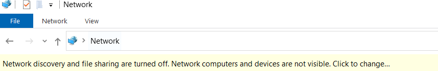

前置
- 远程access当然就需要[[vpn]]

资源管理器 - 左侧`Network`，看到这个
- 可以按那个黄条打开，看到本来看不到的东西（比如[[share]]中就需要用到）
- 有些东西直接在这个界面看不到，但是其实客观存在，输入地址就可以访问
  - 往往是`\\`开头的地址，比如`\\msrasia\Users\...`这个样
  - 这个过程往往不咋快，因为公司[[vpn]]不可能很快
- 下方快速启动栏资源管理器图标右键快速打开可能也有共享文件夹。此时点了之后请耐心等候，不要点很多次，否则会出来很多个