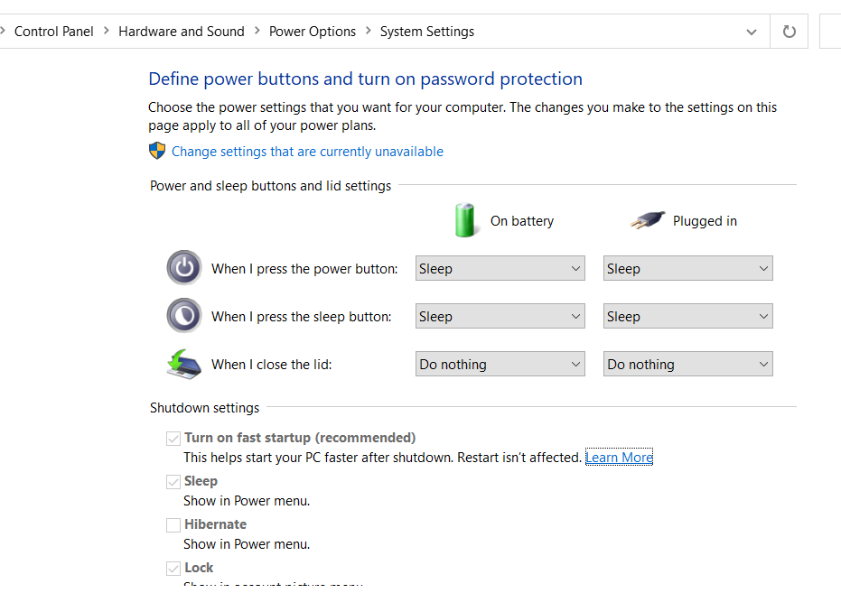

- 管理开机启动
- 参考
  - https://zhuanlan.zhihu.com/p/265933454
- 基本
  - 去除（可能需要结合参考使用，或不同系统版本方法不同）
    - [[task-manager]]
      - 详情-Startup
      - 或直接Startup按钮
    - 开始菜单搜索startup
  - 增加
    - 运行（`Win+R`）-`shell:startup`，添加想要的快捷方式
- fast startup
  - [[control-panel]] 这个地方
  - 点完盾，可以选择开关
  - 在[[windows-ubuntu]]时可能造成Ubuntu18网卡出问题
    - 注意这个选项在重启时没用。所以重启也不会引发Ubuntu18网卡问题