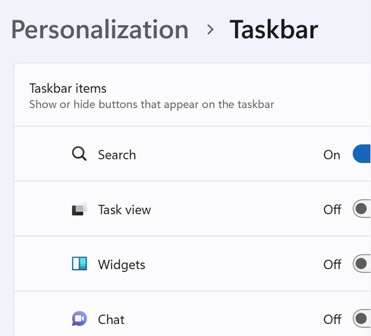

- 和[[file-explorer]]密切相关
  - 如果任务栏没了等等问题，可能[[task-manager]]重启[[file-explorer]]
  - 或者把[[taskbar#non-standard解决方案]]删掉等等
- 下文大部分针对win11
# 设置
- personalization - taskbar
    
- 可设置
  - 托盘有什么
  - 大图标靠左，不挤托盘
  - 等等
## 快捷键
- win11: `win+数字`
  - 按一次打开下面的
  - 连按几次切换/最小化等
- 和[[windows-link]]中的`Ctrl+Alt+字母`可以互补[[aggregation]]
  - 参考[[windows-link]]
# [[non-standard]]解决方案
- https://github.com/valinet/ExplorerPatcher
- 目的：在win11下用win10风格
- 慎重，可能出锅
  - 曾经导致[[file-explorer]]用不了
  - 当时为了卸载，只能用[[aida64]]作为[[temp-solution]]
- 安装之后右键任务栏选项
    - 比如[[multi-display]]时如何显示
    - 比如是否换回Win10等